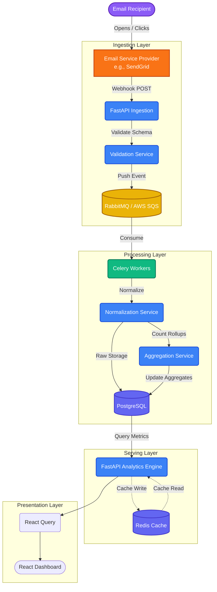

# Module 5: Email Analytics & Reporting Dashboard Architecture

## 1. Purpose

The Email Analytics & Reporting Dashboard (Module 5) serves as the core intelligence layer of our multi-tenant email marketing platform. While other modules handle the design, rendering, and dispatch of email campaigns, Module 5 is strictly responsible for interpreting the aftermath of those dispatches. 

Its primary purpose is to convert raw, high-volume email interaction events (opens, clicks, bounces, deliveries) into actionable, granular, and accessible insights. By ingesting webhook data from external Email Service Providers (ESPs) and processing it through a robust, asynchronous pipeline, this module empowers marketers to measure campaign performance, visualize user engagement, and make data-driven decisions at scale.

## 2. Core Features

- **High-Throughput Event Ingestion**: Robust and secure webhook endpoints built to ingest millions of events from ESPs with sub-second latency.
- **Email Performance Tracking**: Granular tracking of critical deliverability and engagement metrics, including opens, clicks, bounces, and delivery states.
- **Campaign Analytics**: Aggregated views of campaign health, measuring total reach against interaction depth.
- **Click Heatmap Visualization**: Visual overlays mapping where users clicked within the email body, providing spatial engagement context.
- **Time-Series Reporting**: Temporal analysis of user interaction to identify peak engagement windows and campaign tail-ends.
- **Universal Accessibility (WCAG 2.2 AA)**: A deeply accessible dashboard ensuring screen-reader compatibility, keyboard navigation, and cognitive fallbacks for all data visualizations.

## 3. Architecture Design

The system is designed as a distributed, decoupled architecture utilizing asynchronous background processing to ensure the ingestion API is never blocked by database writes or aggregation logic.

### Core Modules Breakdown

- **`WebhookIngestionModule`**: The highly-available API gateway layer (FastAPI) responsible for securely receiving incoming HTTP POST requests from ESPs. It handles initial authentication and request validation.
- **`ValidationService`**: Validates the schema of the incoming JSON payload. Drops malformed payloads and logs anomalies before they enter the processing queue.
- **`EventProcessingService`**: The entry point for the Celery workers. It pulls raw events from the message queue and orchestrates the normalization and storage pipeline.
- **`NormalizationService`**: Transforms ESP-specific payload structures (e.g., SendGrid vs. Mailgun formats) into our platform's unified internal event schema.
- **`StorageService`**: Manages direct interactions with PostgreSQL, handling the batch-inserts of raw events using bulk operations.
- **`AggregationService`**: Computes running totals and metric rollups (e.g., aggregating hourly clicks per campaign) to prevent expensive read-time calculations.
- **`AnalyticsEngine`**: The querying layer that serves the frontend. It calculates dynamic rates (e.g., Open Rate, CTR) on the fly based on the pre-aggregated data.
- **`HeatmapService`**: Processes spatial click data (X/Y coordinates or specific link IDs) to generate the intelligence required to overlay engagement heatmaps on the email preview.
- **`CacheService (Redis)`**: Manages short-lived, high-read data. It caches expensive dashboard queries and handles webhook rate-limiting.
- **`QueueService`**: Interfaces with RabbitMQ / AWS SQS to ensure durable, guaranteed delivery of webhook events to the background workers.
- **`APIService`**: The REST/GraphQL interface serving the React dashboard. Handles authentication, routing, and serialized data delivery.
- **`DashboardService`**: The React/TypeScript frontend boundary, managing state, data-fetching, and accessible UI rendering.

## 4. Mermaid Flow Diagram

## 5. Execution Flow

The lifecycle of an event from user interaction to dashboard visualization follows a strict asynchronous path:

1. **Email is Sent**: A campaign is successfully dispatched to the recipient's inbox.
2. **User Interaction**: The user opens the email (firing a tracking pixel) or clicks a cloaked link.
3. **Event Generation**: The external Email Provider records the interaction and prepares a payload.
4. **Webhook Receives Event**: The provider fires an HTTP POST to our `WebhookIngestionModule`.
5. **Event is Validated**: FastAPI rapidly validates the payload signature and structure. If valid, it returns a `202 Accepted` immediately.
6. **Event is Pushed to Queue**: The validated payload is published to a RabbitMQ/SQS exchange to decouple the API from the database.
7. **Worker Processes Event**: A Celery worker picks up the message, normalizes the data into our universal schema, and extracts metadata (User Agent, IP, Location).
8. **Data is Stored and Aggregated**: The raw event is written to the `events` table. The `AggregationService` atomically increments the respective counter (e.g., `clicks = clicks + 1`) in the `campaign_metrics` table.
9. **Dashboard Fetches Insights**: The marketer opens the React dashboard. The `APIService` fetches the aggregated metrics (hitting Redis cache first), and the UI renders the accessible charts and KPIs.

## 6. Data Modeling Strategy

To handle high-velocity write operations while supporting multi-tenant isolation, the database schema is highly optimized.

- **`events` Table (Raw Storage)**: Append-only table storing discrete interactions. Heavily partitioned by `tenant_id` and `timestamp` (e.g., weekly partitions).
- **`campaign_metrics` Table (Aggregated Data)**: Stores pre-calculated rollups (total sent, total opens, total bounces). This ensures dashboard load times remain constant regardless of the number of raw events.
- **JSONB for Metadata**: We utilize PostgreSQL's `JSONB` column type to store flexible event metadata (e.g., device type, browser, client OS) without requiring continuous schema migrations.
- **Multi-Tenant Design**: Every table strictly includes a `tenant_id`. All queries are forced to filter by this ID to guarantee data isolation. Row-Level Security (RLS) policies are enforced at the database level so cross-tenant data leakage is fundamentally impossible.
- **Indexing Strategy**: BRIN (Block Range) indexes are applied to the `timestamp` column on the `events` table for fast time-series retrieval. B-Tree indexes are applied to `tenant_id` and `campaign_id`.

## 7. Analytics Engine

The `AnalyticsEngine` sits between the raw data and the API, responsible for transforming numbers into business intelligence.

- **Open Rate**: `(Unique Opens / (Total Sent - Total Bounces)) * 100`
- **Click-Through Rate (CTR)**: `(Unique Clicks / Unique Opens) * 100` (or against Delivered, depending on tenant preference).
- **Bounce Rate**: `(Total Bounces / Total Sent) * 100`. Alerts are generated if this exceeds 5%.
- **Time-Based Aggregation**: Queries utilize `date_trunc('hour', timestamp)` to group events, allowing the frontend to plot precise time-series line charts of engagement decay.
- **Heatmap Generation Logic**: The engine maps `link_id`s or `URL`s clicked against the original MJML/HTML template. By calculating the frequency of each link click, it generates a relative temperature score (0.0 to 1.0) for visual overlay.

## 8. Frontend Architecture

The user interface is built for speed, modularity, and accessibility.

- **React Component Structure**: Atomic design principles. Reusable components (e.g., `<StatCard />`, `<TimeSeriesChart />`, `<HeatmapOverlay />`) are composed to build complex dashboard views.
- **Data Fetching (TanStack Query)**: We use React Query for aggressive state management, background refetching, and caching API responses. This handles loading states and error retries seamlessly.
- **UI Design System**: A strict adherence to Tailwind CSS utility classes, governed by a curated design token system (colors, spacing, typography) to maintain brand consistency and premium aesthetics.
- **Chart Rendering**: We rely on Recharts (or Chart.js) for SVG/Canvas based data illustration, heavily customized to fit the platform's visual identity.

## 9. Accessibility Architecture (VERY IMPORTANT)

Accessibility is not an afterthought; it is structurally integrated into the reporting dashboard to meet and exceed WCAG 2.2 AA standards.

- **ARIA Roles and Labels**: All interactive elements and visual charts are tagged with descriptive `aria-labels` and `role="region"`.
- **Screen Reader Compatibility**: Visual charts are inherently hostile to screen readers. We utilize `<VisuallyHidden>` components to provide summarized textual analysis of the chart's data (e.g., *"Line chart showing opens peaking at 10 AM with 4,500 opens"*).
- **Keyboard Navigation**: The entire dashboard, including date pickers and chart tooltips, is entirely navigable via the `Tab`, `Enter`, `Space`, and arrow keys. Focus rings are highly visible and never suppressed (`outline-none` is only used when tightly coupled with `focus:ring-2`).
- **Focus Management**: We employ deliberate focus trapping inside modals (like deep-dive metric views) and use Roving TabIndex for complex data grids.
- **WCAG AA Color Contrast**: All chart colors, text, and Heatmap gradients are validated to meet the minimum 4.5:1 contrast ratio against their backgrounds.
- **Data Table Fallback**: Every visual chart includes an explicit toggle to view the exact same data as a semantically correct HTML `<table>`. This is crucial for cognitive accessibility and users who rely on structured data navigation.

## 10. Scalability & Performance

Designed to scale horizontally as event volume increases.

- **Async Processing Using Queues**: Webhook endpoints do zero processing. They validate and push to RabbitMQ. This ensures the API can handle massive concurrency spikes without dropping payloads.
- **Horizontal Worker Scaling**: Celery workers can be scaled up automatically (e.g., via Kubernetes HPA) based on queue depth.
- **Caching with Redis**: Complex dashboard queries (e.g., 30-day aggregate trends) are cached in Redis for 5-15 minutes. This protects the database from repeated heavy aggregations during peak dashboard usage.
- **Batch Aggregation Jobs**: Instead of updating the `campaign_metrics` table on every single event, workers use micro-batching (updating records in memory and flushing to PostgreSQL every few seconds) to drastically reduce transaction overhead.
- **Database Optimization**: Connection pooling (via PgBouncer) prevents connection exhaustion from the highly concurrent fastAPI layer and Celery workers.

## 11. Security & RBAC

Data integrity and privacy are enforced at every layer.

- **Authentication**: JWT-based auth limits access to the dashboard. Webhooks are authenticated via HMAC signature verification to prevent spoofing.
- **Role-Based Access Control (RBAC)**: 
  - *Admin*: Full access to export data, configure webhook destinations, and view all campaigns.
  - *Marketer*: Can view analytics and generate reports, but cannot alter workspace settings.
  - *Viewer*: Read-only access for internal stakeholders.
- **Multi-Tenant Data Isolation**: PostgreSQL Row-Level Security (RLS) ensures that even if a developer writes a flawed query (e.g., forgetting `WHERE tenant_id = X`), the database engine will outright reject the query, preventing cross-tenant data exposure.

## 12. Error Handling & Observability

Ensuring the system operates predictably when under stress or facing external outages.

- **Handling Webhook Failures**: If our ingestion API goes down, the ESPs are configured to retry with exponential backoff.
- **Duplicate Event Handling**: The ESPs occasionally deliver the same event twice. We enforce uniqueness via an `event_id` constraint in the database. When the worker encounters a `UniqueViolation`, the duplicate is silently discarded without triggering an error.
- **Logging Strategy**: Structured JSON logging across all Python services. This allows seamless ingestion into Datadog or ELK stacks.
- **Monitoring and Alerts**: Alerts are configured for:
  - Queue depth exceeding 10,000 messages (Worker starvation).
  - API 5xx error rate > 1%.
  - Dead Letter Queue (DLQ) volume increases.

## 13. Future Improvements

The architecture is designed to accommodate the following future enhancements:

- **Real-Time Analytics (WebSockets)**: Upgrading the React Query polling to real-time WebSocket subscriptions for live-streaming "Launch Day" views.
- **Data Warehouse Integration**: Implementing an ETL pipeline to sync historical aggregated data to BigQuery or Amazon Redshift for long-term historical analysis and business intelligence.
- **AI-Based Engagement Insights**: Using machine learning to parse historical data and automatically suggest the best send times for individual recipients.
- **Predictive Analytics**: Forecasting campaign performance and expected CTR before the campaign finishes sending, based on the initial 15-minute engagement velocity.
